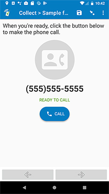

# Phone call

## Description

Use this field plug-in if you would like to make a phone call within your form. Simply supply a valid phone number as a parameter (see the sample form for an example), and this field plug-in will allow you to dial that phone number automatically. For the best results (and more features), use Collect v2.70.4 or later for Android with Collect set as the default phone app.

## Features

* **Call a phone number**  
  Can be used to automatically dial a phone number that is defined by the form. For example, a number can be supplied from an attached dataset.
* **Hide phone number from user**  
  The destination phone number can be hidden from the user (to protect the identity of the respondent). You can also supply an optional phone number label to use instead of the phone number. This can be helpful if you wish to hide the number, but still want some way to help the enumerator identify the respondent. **Please note:** this feature is only available for phone calls made within _Collect_ itself. This requires _Collect_ to be set as the default phone app, which is only available in _Collect_ v2.70.4 and later for Android.

## Parameters

| Key | Value |
| --- | --- |
| `phone_number` (required) | The phone number to dial. |
| `hide_phone_number` (optional) | Set this to `1` to hide the phone number from the user. If this is enabled, calls can only be made on Android while _Collect_ is the default phone app. Setting this to `1` will disable this field for iOS and web. |
| `phone_number_label` (optional) | Supply an alternate label to use for the phone number when `hide_phone_number=1`. |

## How the response is stored

> [`TIMESTAMP`] The following phone number was called:  `phone_number`.

* This response will use the `phone_number` value from the parameter, and `TIMESTAMP` will be the current date and time.
* If `hide_phone_number=1`, then the phone number will not appear in the response data. It will instead show the `phone_number_label` (if one is supplied).
* If you're using iOS or web forms, this response will be appended to the response (on a new line) whenever the _Call_ button is clicked.
* If you're using Android, this response will be appended to the response (on a new line)

> [`TIMESTAMP`] Failure calling the following phone number: `phone_number`.

* If you're using Android, the above response will be appended to the current response (on a new line) if there was an error making the call.

## How to use

1. Download the sample form [extras/sample-form](https://github.com/surveycto/phone-call/raw/master/extras/sample-form/Phone%20call%20sample%20form.xlsx) from this repo and upload it to your SurveyCTO server.
1. Download the [phone-call.fieldplugin.zip](https://github.com/surveycto/phone-call/raw/master/phone-call.fieldplugin.zip) file from this repo, and attach it to the test form on your SurveyCTO server.
1. Make sure to provide the correct parameters (see below).

**Note:** it is suggested to use values stored in other fields for the parameters. Take a look at the test form to see how this is accomplished.

## More resources

* **Sample form**  
[extras/sample-form](https://github.com/surveycto/phone-call/raw/master/extras/sample-form/Phone%20call%20sample%20form.xlsx)
* **Developer documentation**  
Instructions and resources for developing your own field plug-ins.  
[https://github.com/surveycto/Field-plug-in-resources](https://github.com/surveycto/Field-plug-in-resources)
* **User documentation**  
How to get started using field plug-ins in your SurveyCTO form.  
[https://docs.surveycto.com/02-designing-forms/03-advanced-topics/06.using-field-plug-ins.html](https://docs.surveycto.com/02-designing-forms/03-advanced-topics/06.using-field-plug-ins.html)
